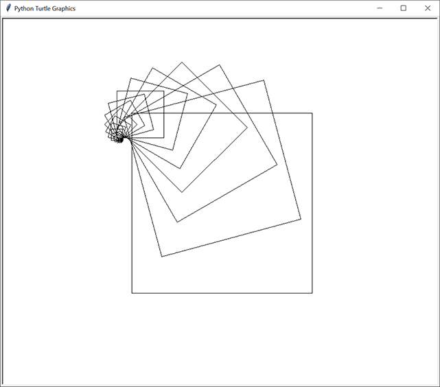
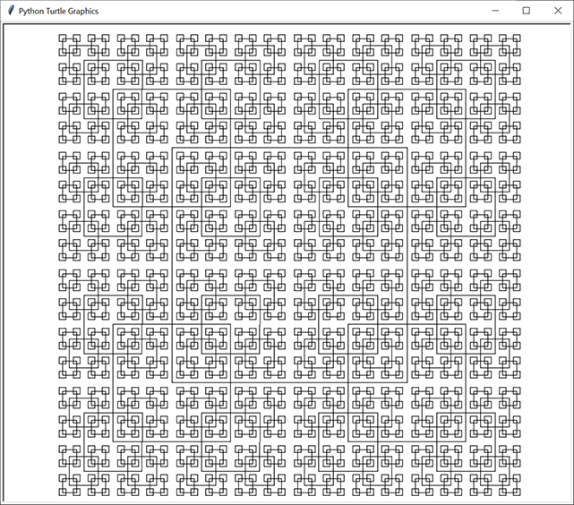
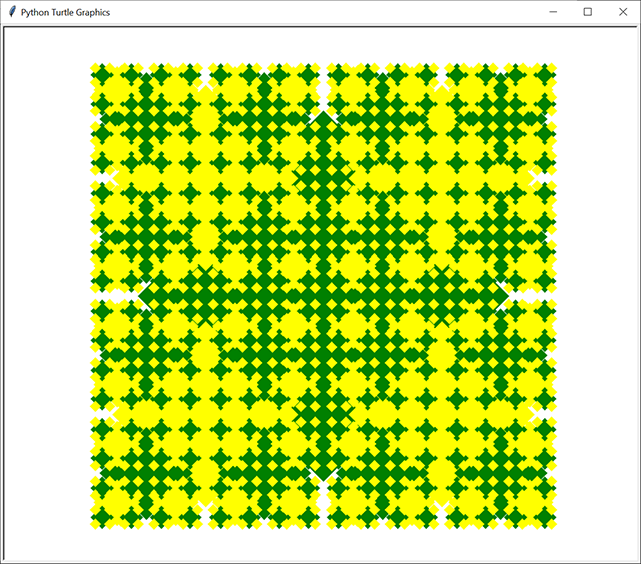

Droste Draw
======

A Python module for making recursive drawings (like the Droste effect) with the built-in turtle module.

THIS MODULE IS CURRENTLY UNDER CONSTRUCTION. To see some demos, run `python -m drostedraw` and look
at the code in the `main()` function of the module.

Some drawings made with Droste Draw:

Installation
------------

To install with pip, run:

    pip install drostedraw

Quickstart Guide
----------------

TODO - fill this in later

Contribute
----------

If you'd like to contribute to Droste Draw, check out https://github.com/asweigart/drostedraw
